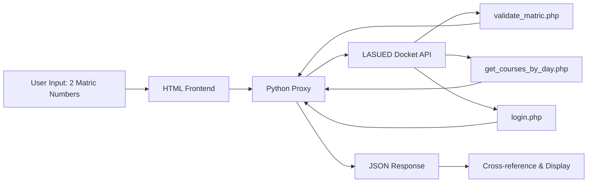

<p align="center">
  
</p>

<h1 align="center">LASUED Exam Schedule Comparator</h1>

<p align="center">
  <b>Compare exam halls, times, and batches with any classmate  directly from the school docket.</b>
</p>

<p align="center">
  
  
  
  
</p>

---

## 📋 Overview

**LASUED Exam Schedule Comparator** is a lightweight web tool that lets you compare two students' CBT exam schedules side by side. It fetches real-time data from the official LASUED exam docket and shows:

- 💙 **Same Hall & Time**:  You'll sit together
- 🟡 **Same Hall, Different Time**:  Same venue, different batch
- 🔴 **Different Halls**:  Separate venues entirely
- ⚪ **Not Shared**:  Only one person has the course

---

## 🎨 Design Philosophy

| Element | Choice | Rationale |
|---------|--------|-----------|
| **Primary Font** | Playfair Display | Classic serif  authoritative, academic |
| **Body Font** | Lato | Warm, friendly sans-serif for readability |
| **Monospace** | Space Mono | Geometric contrast for data & codes |
| **Color Scheme** | Monochromatic Blue | Professional, calming, school-appropriate |
| **Icons** | Custom SVG | Sharp at any size, no emoji dependency |
| **Layout** | Card-based, responsive | Clean hierarchy, works on mobile |

---

## 🧠 How It Works



1. **Input**:  Two matric numbers entered in the web UI
2. **Proxy**:  Python server forwards requests (bypasses CORS)
3. **Fetch**:  Three API endpoints queried per student
4. **Compare**:  Venue, time, and batch cross-referenced per course
5. **Display**:  Summary cards + per-course breakdown

---

## 🚀 Quick Start

### Prerequisites
- Python 3.7+
- A modern web browser (Chrome/Firefox/Edge)

### 1. Clone the repository
```bash
git clone https://github.com/0xProgress/LASUED-Exam-Schedule-Comparator.git
cd LASUED-Exam-Schedule-Comparator
```

### 2. Start the proxy server
```bash
python3 proxy.py
```
You should see:
```
Proxy running on http://localhost:8765
```

### 3. Open the tool
Open `index.html` in your browser. That's it.

---

## 🌐 Deploying to Production

### Render (Recommended  Free)

1. Push this repo to GitHub
2. Create a new **Web Service** on [render.com](https://render.com)
3. Set the start command: `python proxy.py`
4. Render auto-detects Python  deploys in ~2 minutes
5. Update `index.html` with your Render URL:
   ```javascript
   const API = 'https://your-proxy.onrender.com';
   ```
6. Host `index.html` on **GitHub Pages**, **Netlify**, or **Vercel** (all free)

### Railway / Fly.io

Same `proxy.py` works  just point your deployment to it.

---

## 📁 Project Structure

```
LASUED-Exam-Schedule-Comparator/
├── index.html          # Frontend (HTML + CSS + JS, single file)
├── proxy.py            # Python CORS proxy server
├── requirements.txt    # Python dependencies (empty  stdlib only)
├── render.yaml         # Render deployment config
├── LICENSE             # MIT License
└── README.md           # You're reading it
```

---

## 🔌 API Endpoints Used

| Endpoint | Method | Params | Returns |
|----------|--------|--------|---------|
| `/api/validate_matric.php` | POST | `matric` | `student_id`, `fullname`, `courses[]` |
| `/api/get_courses_by_day.php` | POST | `student_id` | Exam dates, times, day of week |
| `/api/login.php` | POST | `student_id`, `matric`, `course_code` | Venue, batch, campus, course title |

All data is fetched **in real-time** from the official LASUED docket server.

---

## 🔒 Privacy & Security

- **No data stored**  All queries are ephemeral
- **No tracking**  Zero analytics, cookies, or logging
- **Read-only**  Only fetches publicly available exam schedules
- **Local proxy**  API keys never exposed to the browser

---

## 🛠️ Tech Stack

<p align="center">
  
  
  
  
</p>

- **Frontend:** Vanilla HTML/CSS/JS  zero dependencies, zero frameworks
- **Backend Proxy:** Python 3 stdlib (`http.server`, `urllib`)  no pip installs needed
- **Fonts:** Google Fonts (Playfair Display, Lato, Space Mono)
- **Icons:** Inline SVG  crisp, customizable, no external assets

---

## 🎯 Use Cases

| Scenario | What It Tells You |
|----------|-------------------|
| **Study partners** | Are we in the same hall? Can we walk in together? |
| **Project teammates** | Do we have the same exam slots free for meetings? |
| **Friends** | Which days are we on campus at the same time? |
| **Curiosity** | Just wondering where your classmates are seated |

---

## 📝 License

This project is licensed under the **MIT License**  see the [LICENSE](LICENSE) file for details.

---

## ⚠️ Disclaimer

This tool is **not affiliated with or endorsed by LASUED**. It uses publicly accessible endpoints from the official exam docket website. Use responsibly and do not abuse the API.

---

## 🤝 Contributing

Found a bug? Want to add a feature? PRs are welcome!

1. Fork the repo
2. Create your feature branch (`git checkout -b feature/amazing`)
3. Commit your changes (`git commit -m 'Add something amazing'`)
4. Push to the branch (`git push origin feature/amazing`)
5. Open a Pull Request

---

## 💬 Support

- **Issues?** Open one on GitHub
- **Questions?** DM or email  happy to help
- **LASUED student?** Share with your department group!

---

<p align="center">
  <br>
  <b>Made with 💙 for LASUED students</b>
  <br>
  <sub>Data sourced from the official LASUED Exam Docket • Educational use only</sub>
</p>
